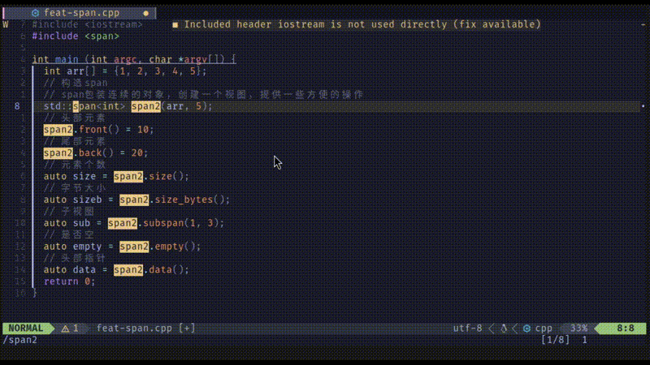

# renamer.nvim

This is a neovim plugin to rename parameters, variables, functions, and more in your code. It uses the built-in rename functionality of neovim lsp.



## Install

Using vim-plug:
```
Plug 'JefferyBoy/renamer.nvim'
```
Using lazy.nvim
```
use {'JefferyBoy/renamer.nvim'}
```

## Commands

`RenameCurrentCursorField`: Rename the symbol under the cursor. You can set to a keymap in your config.

